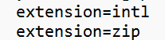

Installation du projet : 

Pour commencer il faut télécharger XAMPP (https://www.apachefriends.org/fr/download.html) et Composer (https://getcomposer.org/download/). Une fois installé il faut cloner le projet dans : C:\xampp\htdocs (ou est installé le xampp), pour cloner le projet il faut faire cette commande : git clone https://github.com/evamln/symfony.git .
Une fois fait et dans le projet il faut faire : "composer install" pour installer tous les packages.

Afin de pouvoir accéder à toutes les fonctionnalités il faut supprimer le ';' au ligne présente dans le screen (extension:zip, extension:intl). Le fichier est php.ini qui se trouve dans : C:\xampp\php

Pour lancer l'application il faut lancer le panel xampp et démarrer Apache et MySQL.

Une fois xampp lancé il faut aller sur ce lien : http://localhost/symfony/public/fr/home
(fr pour avoir les pages en français et en pour les avoirs en anglais)
Si le projet est dans un dossier suplémentaire et pas uniquement dans le htdocs il faudra le rajouter entre localhost et symfony_base

Pour la création de la db voici ce qu'il faut mettre dans le fichier .env.local qui doit être crée : DATABASE_URL="mysql://root:@localhost:3306/jojo"

Afin de créer cette db il faut faire ces commandes : 
"php bin/console doctrine:database:create"
"php bin/console doctrine:migrations:diff"
"php bin/console doctrine:migrations:migrate"
"php bin/console doctrine:fixtures:load"

Partie technique du projet: 

Mon entité principale est Personnage

Pour mon enum, nous avons PersonnagesEtat qui correspond à s'il est mort vivant ou inconnu
Pour ma relation OneToMany nous avons l'entité Poses, un personnages peut avoir plusieurs poses
Pour ma relation OneToOne nous avons l'entité Stand, un personnage ne peut avoir qu'un seul stand (il peut ne pas en posséder du tout)
Pour ma relation ManyToOne nous avons l'entité Statut, plusiuers personnages peuvent être des personnages principaux/Allié/Ennemi
Pour ma relation ManyToMany nous avons l'entité Saisons, plusieurs personnages peuvent être dans plusieurs saisons

Pour les entité enfant :
Mon entité stand à 2 entité enfant qui lui sont propre Pouvoirs et Points fort qui sont toutes les 2 de type ManyToMany 

Il y a un jeu de données dans les fixtures afin d'avoir chaque type de relation.
Il y a également un compte utilisateur afin d'avoir accès à certaine page si nous sommes admin (à voir dans la fixture User)
Il y a donc un système de connexion. Nous pouvons créer des nouvelles entités même sans être connecté mais nous ne pouvons pas les modifier ou supprimer ou accéder à la page User si nous ne sommes pas admin.

Comme expliqué précedemment avec le lien nous pouvons choisir si nous souhaitons le site en français ou en anglais, nous retrouvons un système de traduction. 

Nous avons une page d'accueil avec les statistiques du nombre de personnages Mort/Vivant/Inconnu ainsi que son taux. Nous retrouvons également les 5 derniers personnages crées.

